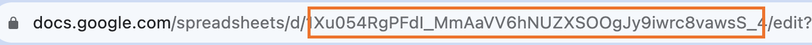

# RetroSheet-TS

Thanks to : [Retrosheet by theApache64](https://github.com/theapache64/retrosheet)

## Install


```shell
npm i retrosheet-ts
```


## Usage ⌨️

### Fetch Google Sheet Data.

#### Get Spreadsheet ID
Get Spreadsheet ID from spreadsheet url.


#### Get Data
```js
import { fetchRetrosheetData } from 'retrosheet-ts';

const response = await fetchRetrosheetData("<Spreadsheet ID>", { sheetName: "notess", query: "select * limit 2" })
```

<details>
<summary>Output</summary>

```json
[
  {
    "created_at": "26/08/2023 17:37:06",
    "title": "Hello",
    "description": "Description"
  },
  {
    "created_at": "26/08/2023 17:37:28",
    "title": "Yogesh",
    "description": "Description"
  }
]
```

</details>

### Write Data to Google Sheet.

Follow steps 1 - 4 from [here](https://github.com/theapache64/retrosheet)

#### Get Form ID
Get form id Form URL


#### Write data
```js
import { writeRetrosheetData } from 'retrosheet-ts';

const request = {
    'Title': "test title",
    'Description': 'test Description'
}
writeRetrosheetData("<FORM_ID>", request)
```
**_Note: Keys of request must be the same as Form Field name._**

